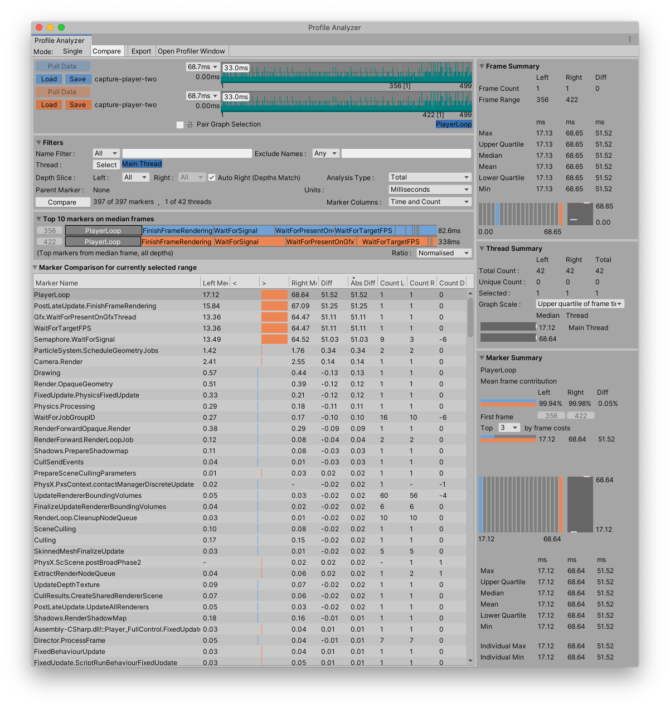

# Comparing frames from the same data set

This workflow explains how to compare two frames from the same data set. In this example, it explains how to compare the median and longest frames in a data set. Comparing the median and longest frames is useful to help understand what is happening in the longest frame that is not happening in an average frame, or what is taking longer than average to complete.

## Step 1: Collect performance data to analyze

Open the Profile Analyzer window (menu: **Window &gt; Analysis &gt; Profile Analyzer**) and collect some profiling data. To pull data from an active profiling session, click the **Pull Data** button. This pulls in the current set of available frames from the Profiler. If you don't have an active profile session, click the **Open Profiler Window** button, then load or record some data.

For more information on how to collect data, see the workflow documentation on [Collecting and viewing data](collecting-and-viewing-data.md).

## Step 2: Open Compare view

Click the **Compare** button in the toolbar to switch to the [Compare View](compare-view.md).

## Step 3: Select the median and longest frames

1. In the [Frame Control](frame-range-selection.md) pane, right click on the top graph and choose **Select Median Frame** from the context menu.
1. Next, right click on the lower graph and choose **Select Longest Frame** in the context menu.

 *The Frame Control context menu*

The Profile Analyzer then analyzes the two frames and displays the data for the median and longest frames like so:

 *The Profile Analyzer window with the median and longest frames of the same data set selected*
