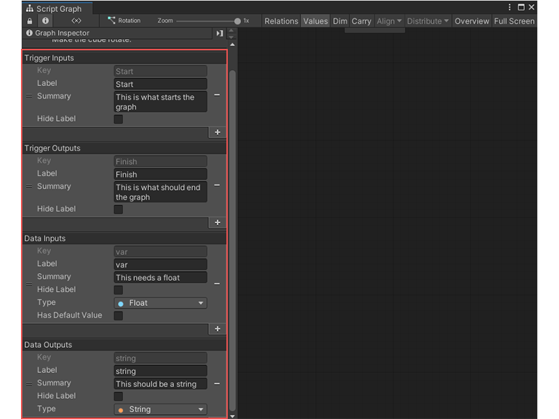

# Add a Trigger or Data port to a Script Graph

When you use a Script Graph as a Subgraph, you can pass data and logic to it from its parent graph. Add and define ports on your graph to determine which logic and data you can pass to it. 

To add a Trigger Input, Trigger Output, Data Input, or Data Output port to a Script Graph:

1. If you haven't already, [open the Script Graph you want to edit in the Graph window](vs-open-graph-edit.md). 

2. With no nodes selected, in the Graph Inspector, select **Add** (+) under the port type you want to add to your Script Graph: **Trigger Inputs**, **Trigger Outputs**, **Data Inputs**, or **Data Outputs**. 

    > [!TIP]
    > If the Graph Inspector isn't visible in the Graph window, select **Graph Inspector** () from the toolbar.

3. In the **Key** field, enter a unique key name for your port. This name can't be the same as any existing ports on your currently selected Script Graph. 

4. (Optional) In the **Label** field, enter any text you want to appear as a label for the port on a Subgraph, Input, or Output node for your current Script Graph. Otherwise, Visual Scripting uses the value in the **Key** field as a label.

5. (Optional) In the **Summary** field, enter any text that you want to appear as a brief summary of the port in the Graph Inspector when you select a Subgraph, Input, or Output node for your current Script Graph.

6. (Optional) Select **Hide Label** to hide the label for the port on any Subgraph, Input, or Output node for your current Script Graph. 

7. (Data Inputs and Data Outputs Only) Select the **Type** list to open the Type menu and select a type for the data your port should accept. 

8. (Data Inputs Only) Select **Has Default Value** to enable the **Default Value** field and specify a default value for your Script Graph's Data Input, if your graph doesn't receive another input while it runs. 

## Next steps

You can now specify triggers and data for your Script Graph when you use it as a Subgraph in another Script Graph. For more information on each port type, see Subgraph inputs and outputs in [Subgraphs](vs-subgraphs.md#subgraph-inputs-and-outputs). 

For more information on adding a Script Graph as a Subgraph, see [Add a Subgraph to a Script Graph](vs-add-subgraph.md).