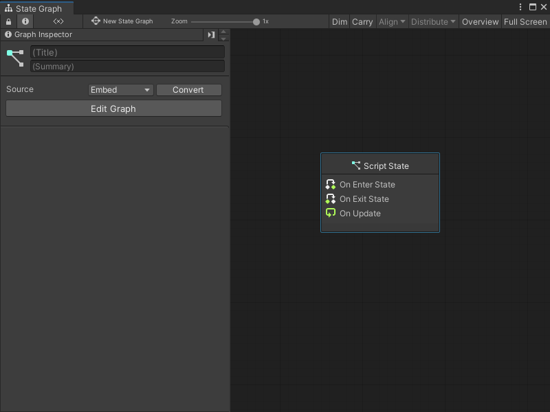
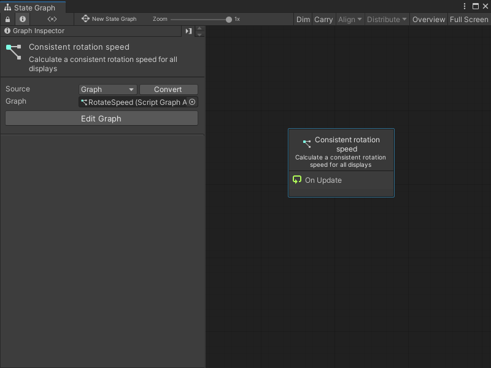
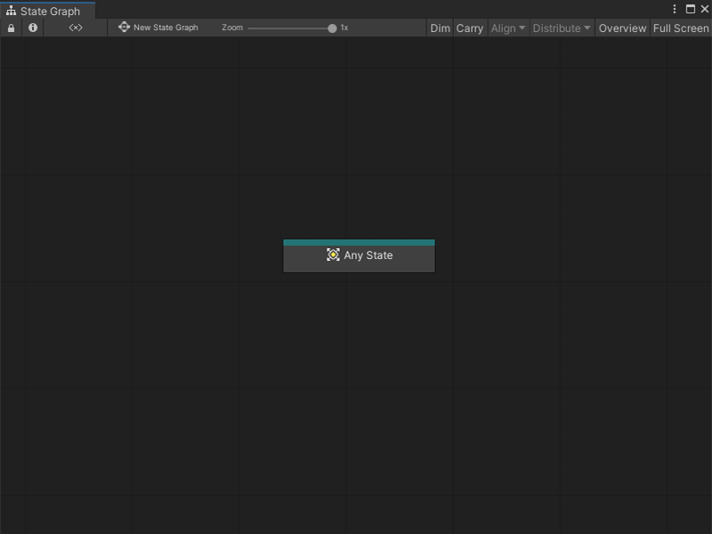
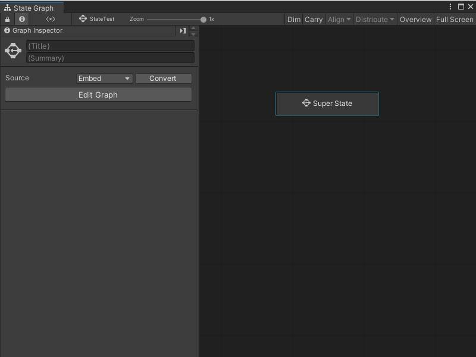
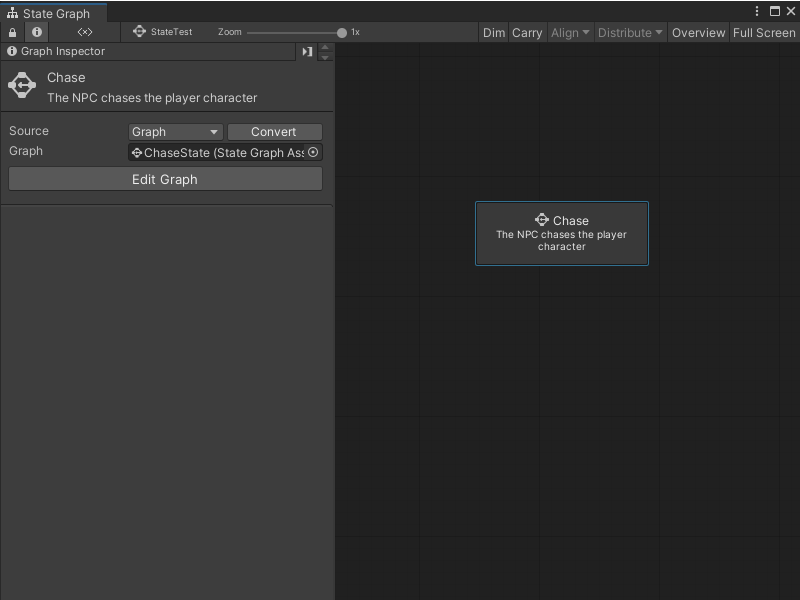

# Create a new state 

You can create three types of State nodes in your State Graphs: [Script States](#create-a-script-state), [Any States](#create-an-any-state), and [Super States](#create-a-super-state). For more information on the types of State nodes, see State Graphs in [Graphs](vs-graph-types.md#state-graphs).

## Create a Script State

To create a new blank Script State: 

1. With a State Graph [open in the Graph window](vs-open-graph-edit.md), right-click on an empty space in the Graph Editor to open the context menu. 
    For more information on creating State Graphs, see [Creating a new graph file](vs-create-graph.md).

2. From the context menu, select **Create Script State**. 
    Visual Scripting creates a new Script State node. 

3. In the Graph Inspector, choose a source for your new Script State's Script Graph: 

   - **Embed**: The graph only exists on the Script State node. You can only modify the graph from the node in its parent State Graph.
   - **Graph**: The graph exists in a separate file. You can modify the graph outside of its parent State Graph and reuse the graph in other areas of your application. 

    > [!TIP]
    > If the Graph Inspector isn't visible in the Graph window, select **Graph Inspector** () from the toolbar.

3. If you chose **Graph**, select **New**, enter a name for your graph file, and choose where you want to save it. Select **Save**. 

To create a Script State from an existing Script Graph: 

1. With a State Graph [open in the Graph window](vs-open-graph-edit.md), right-click on an empty space in the Graph Editor to open the context menu. 
    For more information on creating State Graphs, see [Creating a new graph file](vs-create-graph.md).

2. From the context menu, select **Create Script State**.
    Visual Scripting creates a new Script State node.

3. In the Graph Inspector, set your **Source** to **Graph**. 

    > [!TIP]
    > If the Graph Inspector isn't visible in the Graph window, select **Graph Inspector** () from the toolbar.

4. In the **Graph** field, select the target icon and choose a compatible Script Graph from your project. You can also click and drag a Script Graph file from your Project window and drop it into the **Graph** field. 

> [!TIP]
> For a faster way to add a Script Graph as a Script State, click and drag the Script Graph from your Project window into the Graph Editor to automatically create a Script State node. 

## Create an Any State 

To create a new Any State node: 

1. With a State Graph [open in the Graph window](vs-open-graph-edit.md), right-click on an empty space in the Graph Editor to open the context menu. 
    For more information on creating State Graphs, see [Creating a new graph file](vs-create-graph.md).

2. From the context menu, select **Create Any State**. 

## Create a Super State 

To create a new blank Super State: 

1. With a State Graph [open in the Graph window](vs-open-graph-edit.md), right-click on an empty space in the Graph Editor to open the context menu. 
    For more information on creating State Graphs, see [Creating a new graph file](vs-create-graph.md).

2. From the context menu, select **Create Super State**. 
    Visual Scripting creates a new Super State node. 

3. In the Graph Inspector, choose a source for your new Super State's State Graph: 

   - **Embed**: The graph only exists on the Super State node. You can only modify the graph from the node in its parent State Graph.
   - **Graph**: The graph exists in a separate file. You can modify the graph outside of its parent State Graph and reuse the graph in other areas of your application. 

    > [!TIP]
    > If the Graph Inspector isn't visible in the Graph window, select **Graph Inspector** () from the toolbar.

3. If you chose **Graph**, select **New**, enter a name for your graph file, and choose where you want to save it. Select **Save**. 

To create a Super State from an existing State Graph: 

1. With a State Graph [open in the Graph window](vs-open-graph-edit.md), right-click on an empty space in the Graph Editor to open the context menu. 
    For more information on creating State Graphs, see [Creating a new graph file](vs-create-graph.md).

2. From the context menu, select **Create Super State**.
    Visual Scripting creates a new Super State node.

3. In the Graph Inspector, set your **Source** to **Graph**. 

    > [!TIP]
    > If the Graph Inspector isn't visible in the Graph window, select **Graph Inspector** () from the toolbar.

4. In the **Graph** field, select the target icon and choose a compatible State Graph from your project. You can also click and drag a State Graph file from your Project window and drop it into the **Graph** field. 

> [!TIP]
> For a faster way to add a State Graph as a Super State, click and drag the State Graph from your Project window into the Graph Editor to automatically create a Super State node. 