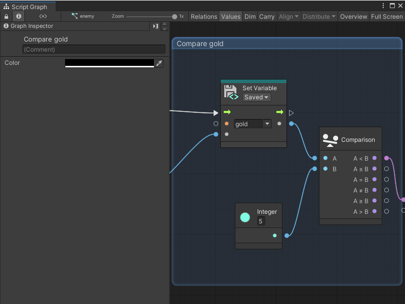

# Create a node group

You can group nodes together in your graphs to help keep things organized. 

To create a new group:

1. With a graph [open in the Graph window](vs-open-graph-edit.md), start in an empty area. Click and hold **CTRL** (macOS: **Cmd** + click) and drag to create a selection around the nodes you want to include in your new group. Release to finish creating the group.

2. (Optional) Click **Group** in the group's header to edit its name. Press **Enter** to save your changes. 

3. (Optional) In the Graph Inspector, in the **(Comment)** field, enter any comments or information you want about your group. The comment is only visible in the Inspector. 

    > [!TIP]
    > If the Graph Inspector isn't visible in the Graph window, select **Graph Inspector** () from the toolbar.

4. (Optional) In the Graph Inspector, select the **Color** field to open the color picker and select a new color for your group. When not selected, your group appears as this color. You can also select the eyedropper icon to choose a color from somewhere on your screen. 

5. (Optional) To resize the group, click and drag from any edge or corner. To move the group and its nodes, click the group's header and drag. 

> [!NOTE]
> You can also move your group without moving any of the nodes inside, but the required input changes depending on your chosen control scheme. For more information, see [Choosing a Visual Scripting control scheme](vs-control-schemes.md)

## Next steps

After you've created a node group, you can [add nodes to your Script Graph](vs-add-node-to-graph.md), [create and add variables](vs-add-variable-graph.md), or [add a Subgraph](vs-add-subgraph.md).
